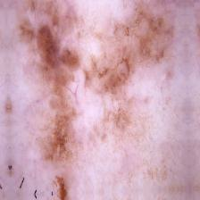
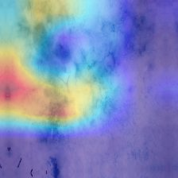
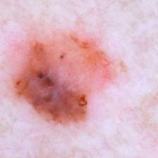
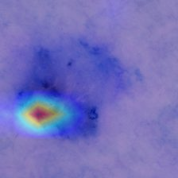

<div align="center">

# 🩺 Melanoma Detection from Skin Lesion Images

**EfficientNetB3 vs MobileNetV2 · transfer learning · Grad-CAM explainability · Streamlit web app**

[](LICENSE)
[](https://www.python.org/)
[](https://www.tensorflow.org/)
[](https://keras.io/)
[](https://streamlit.io/)
[](https://github.com/erfanhspr-04/Melanoma_skin/stargazers)

**English**

</div>

---

A deep-learning system that classifies dermoscopic skin-lesion images as **Melanoma** or **NotMelanoma**, trained with transfer learning on two CNN backbones and explained with **Grad-CAM**. The project ships a **Streamlit web app** (prediction, probability, risk level, heat-map, PDF report) plus the full evaluation of both models and the trained weights.

> ⚠️ Educational / research project — **not** a medical device. No output here replaces a dermatologist's diagnosis.

<!-- After you deploy the app, uncomment the next line and put your Space URL in it:
🔗 **Live demo:** [try it on Hugging Face Spaces](https://huggingface.co/spaces/erfanhspr-04/melanoma-detection)
-->

## ✨ Highlights

- **Two architectures, one honest comparison** — `EfficientNetB3` (93.96 %) and `MobileNetV2` (92.93 %) trained on the same pipeline and evaluated on the same validation split.
- **Explainable by design** — Grad-CAM is computed from the gradient of the predicted class w.r.t. the `block6f_project_conv` feature map, the layer that gave the sharpest localisation on EfficientNetB3.
- **End-to-end, not just a notebook** — data pipeline → training → evaluation → Grad-CAM → Streamlit app → PDF report → GitHub Release with the weights.
- **CPU-friendly and reproducible** — fixed seed, frozen backbone + fine-tuning stage, `ModelCheckpoint` / `EarlyStopping` callbacks, and a `verify_artifacts.py` script that checks every file before you run.
- **Built for trade-offs, not leaderboards** — the lightweight model is kept on purpose: 11 MB vs 83 MB for ~1 point of accuracy.

## 📊 Results

Validation set: **3,564 images** · Training set: **10,683 images** · 2 classes: `Melanoma` / `NotMelanoma`

| Model | Accuracy | Loss | Parameters | Weight size | Role in the project |
|---|---|---|---|---|---|
| **EfficientNetB3** | **93.96 %** | 0.2069 | 10.98 M | ≈ 83 MB | Default model in the app (highest accuracy) |
| MobileNetV2 | 92.93 % | 0.2431 | 2.42 M | ≈ 11 MB | Lightweight option for mobile / low-resource devices |

Full metric table (also in [`results/model_comparison.csv`](results/model_comparison.csv)):

| Model | Accuracy | Precision | Recall | F1-score | Specificity |
|---|---|---|---|---|---|
| EfficientNetB3 | 0.9396 | 0.9104 | 0.9753 | 0.9417 | 0.9040 |
| MobileNetV2 | 0.9293 | 0.8935 | 0.9747 | 0.9323 | 0.8838 |

**Clinically interesting direction — the melanoma class (final model):** sensitivity **≈ 90.5 %**, precision **≈ 97.1 %**. In other words: when the model says "melanoma" it is right about 97 % of the time, and it still misses **169 of 1,783** melanoma cases — which is the error that matters most in a screening setting and is discussed openly in the [limitations](#-limitations).

## 🔍 Explainability (Grad-CAM)

| Input | Explanation |
|---|---|
|  |  |
|  |  |

Six balanced samples were inspected (3 melanoma / 3 not-melanoma) and **all six were classified correctly**; the heat-maps land on the lesion body rather than the surrounding skin:

| Sample | True class | Prediction | Confidence |
|---|---|---|---|
| `sample_1` | Melanoma | Melanoma | 96.84 % |
| `sample_2` | Melanoma | Melanoma | 99.74 % |
| `sample_3` | Melanoma | Melanoma | 99.84 % |
| `sample_4` | NotMelanoma | NotMelanoma | 93.63 % |
| `sample_5` | NotMelanoma | NotMelanoma | 88.45 % |
| `sample_6` | NotMelanoma | NotMelanoma | 78.53 % |

Full log: [`results/GradCAM_final_results.csv`](results/GradCAM_final_results.csv) · images: [`results/GradCAM_Results/`](results/GradCAM_Results)

## 🏗 How it works

flowchart LR
    A["Dermoscopic image"] --> B["Resize 224x224 &mdash; raw pixels 0-255"]
    B --> C["EfficientNetB3"]
    B --> D["MobileNetV2"]
    C --> E["Melanoma / NotMelanoma<br/>+ sigmoid probability"]
    D --> E
    C --> F["Grad-CAM<br/>block6f_project_conv"]
    E --> G["Streamlit app<br/>risk level + PDF report"]
    F --> G

1. **Transfer learning** — ImageNet backbone loaded and frozen; only the new classification head is trained first.
2. **Fine-tuning** — the last layers of the backbone are unfrozen and retrained with a small learning rate (`5e-5`).
3. **Raw input contract** — images enter the network as raw pixels in `[0, 255]`; the preprocessing built into the Keras application handles normalisation. The same contract is used in the notebooks, in `app.py` and in `saved_models/project_config.json`.
4. **Threshold contract** — sigmoid output: `< 0.5` → Melanoma, `≥ 0.5` → NotMelanoma.
5. **Explainability** — Grad-CAM (implemented from scratch with `GradientTape`, not a black-box wrapper) produces the overlay shown in the app.

## 🚀 Quick start

```bash
# 1) clone
git clone https://github.com/erfanhspr-04/Melanoma_skin.git
cd Melanoma_skin

# 2) environment (optional but recommended)
python -m venv venv
venv\Scripts\activate        # Windows
# source venv/bin/activate   # Linux / macOS

# 3) dependencies
pip install -r requirements.txt

# 4) trained weights — download from the Releases page
#    and place them in saved_models/
#    https://github.com/erfanhspr-04/Melanoma_skin/releases

# 5) check that everything is in place
python verify_artifacts.py

# 6) run the app
python -m streamlit run app.py
```

Then open the app, upload a dermoscopic image, and you get: predicted class, probability of each class, risk level and the Grad-CAM overlay — plus an exportable PDF report.

## 📓 Notebooks

| Notebook | Content | Cells |
|---|---|---|
| [`notebooks/01_mobilenet_training.ipynb`](notebooks/01_mobilenet_training.ipynb) | MobileNetV2 — transfer learning + fine-tuning (lightweight model) | 16 |
| [`notebooks/02_efficientnet_and_gradcam.ipynb`](notebooks/02_efficientnet_and_gradcam.ipynb) | EfficientNetB3 — training, evaluation, Grad-CAM, CLAHE test, model comparison | 89 |

## 🗂 Project structure

```text
Melanoma_skin/
├── app.py                        # Streamlit app: prediction, risk level, Grad-CAM, PDF report
├── verify_artifacts.py           # checks that models/results/every required file exists
├── requirements.txt
├── notebooks/
│   ├── 01_mobilenet_training.ipynb
│   └── 02_efficientnet_and_gradcam.ipynb
├── saved_models/
│   ├── README.md                 # how to download the weights
│   └── project_config.json       # image size, class names, Grad-CAM layer, accuracies
├── results/
│   ├── model_comparison.csv
│   ├── GradCAM_final_results.csv
│   └── GradCAM_Results/          # original / CLAHE-enhanced / Grad-CAM per sample
├── docs/images/                  # screenshots used by this README
├── fonts/                        # Vazirmatn — Persian UI font used by the app
├── .streamlit/config.toml        # theme
└── LICENSE
```

## ⚙️ Reproducibility notes

- **Environment:** TensorFlow 2.21 on **CPU only** (no CUDA), so the epoch counts were deliberately kept modest (5 transfer + 5 fine-tuning epochs per model); the full run takes a few hours rather than minutes.
- **Fixed seed** before model creation, data pipeline and training, so the split and the augmentation order are reproducible.
- **Data pipeline:** `image_dataset_from_directory` → `cache()` → `prefetch(AUTOTUNE)`; the hidden `.ipynb_checkpoints` folder is removed so image counts stay exact.
- **Checkpointing:** `ModelCheckpoint(save_best_only=True, monitor='val_accuracy')` + `EarlyStopping(patience=5, restore_best_weights=True)`.
- **Data location (expected by the notebooks):** `Dataset/train/{Melanoma,NotMelanoma}` and `Dataset/valid/{Melanoma,NotMelanoma}`.

## ⚠️ Limitations

- The dataset is **balanced**, while real-world melanoma prevalence is far lower — precision will drop in a genuine screening setting.
- Evaluation is done on the **validation split**; there is no independent held-out test set.
- Training was CPU-bound, so more epochs / larger resolutions may improve the results.
- **169 of 1,783 melanomas** are still missed — the most expensive error class in a medical application.
- Grad-CAM is a sanity check for localisation, **not** a proof of clinical reasoning.
- This is a research/educational artefact, not a diagnostic tool.

## 🗺 Roadmap

- [ ] Deploy a public demo (Hugging Face Spaces / Streamlit Cloud) and link it at the top of this README
- [ ] Report melanoma-positive metrics directly in `model_comparison.csv`
- [ ] GitHub Actions CI: `verify_artifacts.py` + app smoke test
- [ ] Model card (`docs/MODEL_CARD.md`) with intended use, data and metrics
- [ ] Independent test split, plus a calibration curve for the probabilities
- [ ] TFLite / ONNX export of the MobileNetV2 model for on-device inference

## 📄 License

Released under the [MIT License](LICENSE).

## 👤 Author

**Erfan Hosseinpoor** — [@erfanhspr-04](https://github.com/erfanhspr-04)

If this project is useful or interesting to you, a ⭐ helps other people find it.
